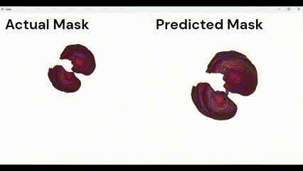

#   3D CT Lung Segmentation using 2D U-Net

This code is for 3D lung segmentation in CT scans using a U-Net model. The dataset consists of 45 patient lung CT scans and their respective masks. The masks contain three labels: trachea, left lung, and right lung. The initial tasks involve removing the trachea (label 5) and merging labels 3 and 4 into one, resulting in a lung mask.

## Preprocessing

The preprocessing steps include:

1.  **Trachea Removal**: Remove the trachea from the masks.
2.  **Label Merge**: Combine labels 3 and 4 into a single label.
3.  **Save Lung Masks**: Save the modified lung masks.

## Training Approaches

The model can be trained in three different ways:

1.  **Individual Training**: Train the model with individual CT scan images and masks.
2.  **Subvolume Training**: Divide or create subvolumes of smaller size and feed them to the model.
3.  **2D Slice Training**: Slice the 3D image into 2D images, train the 2D images, and then combine them to form the 3D model.

In this project, the third approach is followed for computational efficiency.

## Image Analysis

Before training, the CT scan images are analyzed. The image values range from -3500 to 3500 Hounsfield units, requiring normalization. After normalization, the images are segmented into 2D images in all axes (x, y, z) and stored in separate folders.

## Data Splitting

For training data, the sliced images need to be split into training and testing sets. In this project, 80% of the data (36 patients out of 45) is used for training, and 20% (9 patients out of 45) is used for testing.

## Model Training

A U-Net model with four layers is created and trained on the prepared dataset. Once training is complete, the model can be used for segmentation.

## Prediction and Segmentation

The trained model is used to predict a single sliced image. Based on the predictions, a 3D model image is generated. When a 3D image is provided, it will be sliced, segmented in that particular cross-section, and the values will be combined to return the 3D segmented image from the CT scan.

## Comparision

